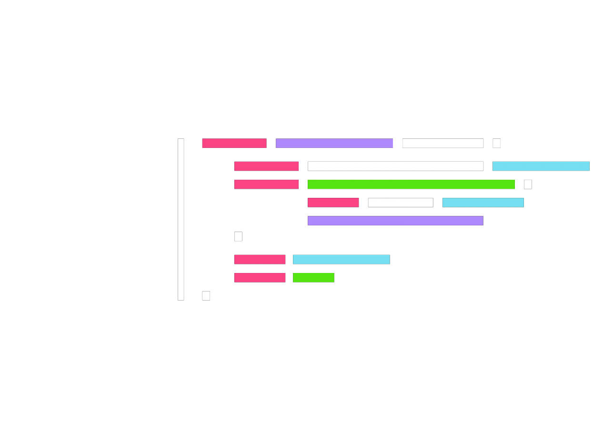

# Portfolio

## This is a complete homework assignmnet where no code was given.

## User Story

```
AS AN employer
I WANT to view a potential employee's deployed portfolio of work samples
SO THAT I can review samples of their work and assess whether they're a good candidate for an open position
```

## Acceptance Criteria

```
GIVEN I need to sample a potential employee's previous work
WHEN I load their portfolio
THEN I am presented with the developer's name, a recent photo or avatar, and links to sections about them, their work, and how to contact them
WHEN I click one of the links in the navigation
THEN the UI scrolls to the corresponding section
WHEN I click on the link to the section about their work
THEN the UI scrolls to a section with titled images of the developer's applications
WHEN I am presented with the developer's first application
THEN that application's image should be larger in size than the others
WHEN I click on the images of the applications
THEN I am taken to that deployed application
WHEN I resize the page or view the site on various screens and devices
THEN I am presented with a responsive layout that adapts to my viewport
```
## My Implementation

I began by creating a wireframe that I drew out on a piece of paper for the overall layout of my website. 
After this was completed I began by creating the `index.html` using semantic `html` elements 
in order to create a well formatted and acessible webpage.

Within my `index.html` you can see the use of semantic html and attributes. I was able to create a nice 
header which included an image and my in page links through the use of styling selectors in my `style.css`

As shown below...
## `html`

```html
<header>
    <div class="top">
        <h1>Nick's Portfolio</h1>
        
    </div>
    <!-- Navigation links -->
    <nav>
        <div><a href="#about">About Me</a></div>
        <div><a href="#projects">Projects</a></div>
        <div><a href="#contact">Contact</a></div>
    </nav>
</header>
```
## `css`
```css
/* My header styling at the top of the webpage */
header{
    display: flex;
    width: 100%;
    text-align: center;
    background-color: var(--accent);
    color: white;
    display: inline-block;
    padding-top: 50px;
}

/* Setting up the header title area */
.top
{
    display: flex;
    justify-content: center;
}

/* Adjusting the sizing and placement of the image in header */
header img{
    height: 10vw;
    margin-left: -3vw;
}
/* My navigation styling which is nested in header in index.html */
nav{
    display: flex;
    justify-content: center;
    font-size: x-large;
    max-width: 70vw;
    margin: auto;
}

/* My navigation link styling which I nest within a div block in index.html */
nav div a{
    background-color: var(--accent);
    list-style: none;
    margin-bottom: 10px;
    display: block;
    color: white;
    text-align: center;
    padding: 14px 16px;
    text-decoration: none;
}
```
The above code was able to acomplish this ...


For each other section of my webpage I used `<section>` tags in order to create a well designed 
information section. Each `<section>` tag has a class called `.container` where I set the overall
style of each section (width, height, color, etc.)

## `html`
```html
 <!-- Section 3 -->
<section class="container" id="contact">
    <div class="left">
        <h2>Contact</h2>
    </div>
    <article>

        <div class="social">

            <a href="mailto:n.krilis@gmail.com"></a>
            <a href="https://github.com/nkrilis"></a>
            <a href="tel:647-330-8919"></a>
            <a href="https://www.linkedin.com/in/nicholas-krilis/"></a>

        </div>
    </article>
</section>
```
## `css`
```css
/* This is my container class which defines the overall sizing and style of each section element */
.container{
    display: flex;
    /* border: 5px solid black; */
    max-width: 70vw;
    margin: auto;
    margin-top: 50px;
}
```
The projects section is where I had to create a `flexbox` property in order to achieve the look I
was going for.

## `css`
```css
/* This is the styling for how the projects will be displayed in Section 2 */
.projects {
    display: flex;
    flex-wrap: wrap;
    justify-content: space-evenly;
}

/* This is the styling for the rest of the projects other than the featured one in Section 2 */
.project-item {
    position: relative;
    margin: 15px;
    text-align: center;
    flex: 25%;
    max-width: 420px;
    min-width: 420px;
    height: 300px;
}

/* Shows selection as you hover over Projects */
.project-item:hover {
    opacity: 50%;
}

/* This is the image styling within Section 2 so that it fits within its section when resized */
.project-image{
    width: 100%;
    height: 100%;
    object-fit:cover;
    border-radius: 20px;
}

/* Styling for the title on top of each project image */
.project-title{
    position: absolute;
    bottom: 30px;
    padding: 20px;
    background-color: rgb(255, 255, 255);
    opacity: 60%;
    border-top-right-radius: 20px;
    border-bottom-right-radius: 20px;
}
```

Through this I was able to achieve ...


Lastly in order to create a responsive page I used the `@media screen` selector in order to adjust what 
happens when the viewport changes in width.

```css
@media screen and (max-width: 600px) {
    nav{
        flex-direction: column;
    }

}
```
This changes the orientation of the `<nav>` to a column when the viewport's width is at 600px.

<br /><br />
## THANK YOU FOR READING :smiley:

## The rest of the code and its documentation can be viewed here [index.html](https://github.com/nkrilis/Portfolio/blob/main/index.html) and [style.css](https://github.com/nkrilis/Portfolio/blob/main/assets/css/style.css)

## The published website can be viewed here [Portfolio](https://nkrilis.github.io/Portfolio/)